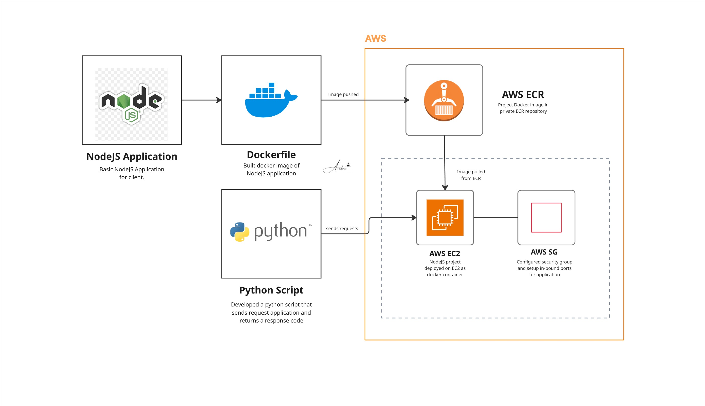

# NodeJS Application Deployment on AWS EC2


## Overview

Dockerized a NodeJS application and deployed it on an AWS EC2 instance. Configured the server environment, set up security group rules for port access, and validated the deployment with a Python health check script that verifies the application response code.

## Architecture



The deployment flow:
- **NodeJS app** containerized with Docker
- **AWS EC2** instance provisioned and configured with prerequisites
- **Security group** configured to expose the application port
- **Python script** validates the deployment by checking the HTTP response code

## Tech Stack

| Layer | Technology |
|-------|-----------|
| Application | NodeJS |
| Containerisation | Docker |
| Server | AWS EC2 |
| Security | AWS Security Group |
| Validation | Python (HTTP response check) |

## What Was Built

**1. Dockerized NodeJS application**
- Wrote a `Dockerfile` packaging the NodeJS application
- Built and tagged the Docker image for deployment

**2. AWS EC2 setup**
- Provisioned an EC2 instance
- Installed Docker and all prerequisites on the server
- Pulled and ran the NodeJS Docker image on the instance

**3. Security group configuration**
- Configured inbound rule to expose the application port
- Application accessible via the EC2 public IP

**4. Python health check script**
- Wrote a 3-line Python script to hit the application endpoint
- Returns the HTTP response code to confirm the app is live and responding

## Project Structure

```
08-nodeJS-DEVOPS/
├── app/                  (NodeJS application)
├── Dockerfile
├── healthcheck.py        (Python response code validator)
└── README.md
```

## Health Check Script

```python
import requests
response = requests.get("http://<EC2-PUBLIC-IP>:<PORT>")
print(f"Status: {response.status_code}")
```

## Key Learnings

- End-to-end EC2 deployment workflow — provision, configure, deploy, validate
- Security group configuration for container port exposure on EC2
- Using a simple Python script as a lightweight health check for deployed applications